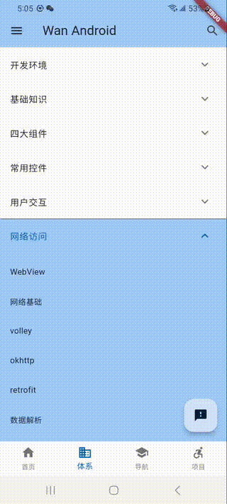
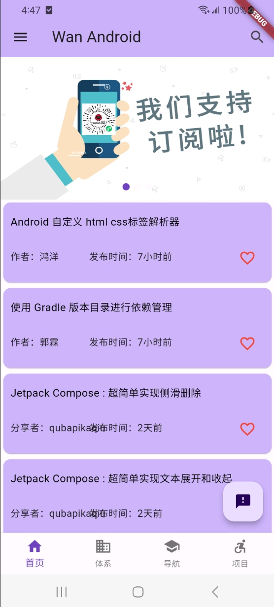
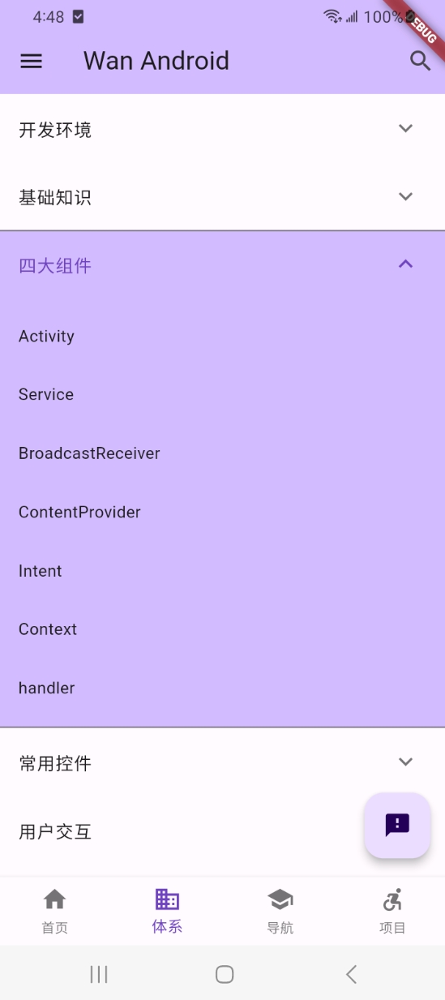
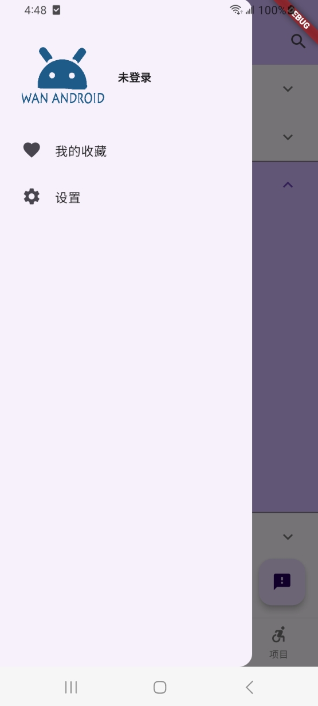
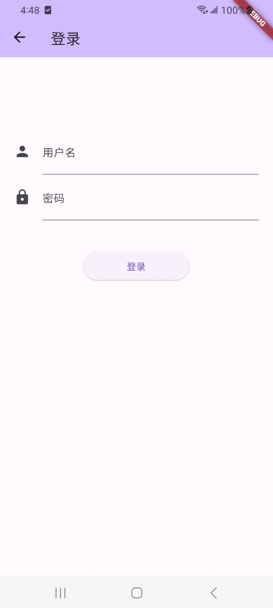
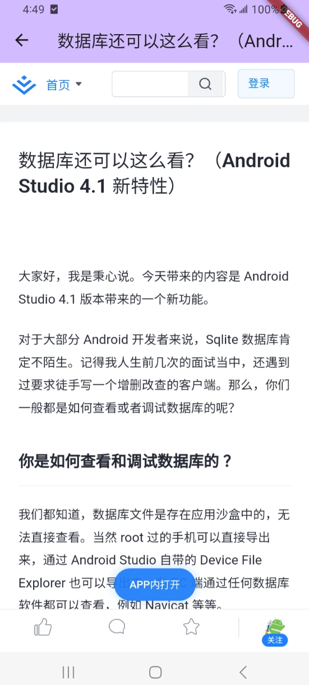

## wan_android_flutter

API from: https://www.wanandroid.com/

- 支持更换主题色。
- 支持登录，收藏
## flutter library
- dio
- shared_preferences
- card_swiper : banner轮播
- webview_flutter
- json_annotation

## 截图

